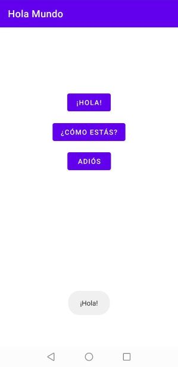
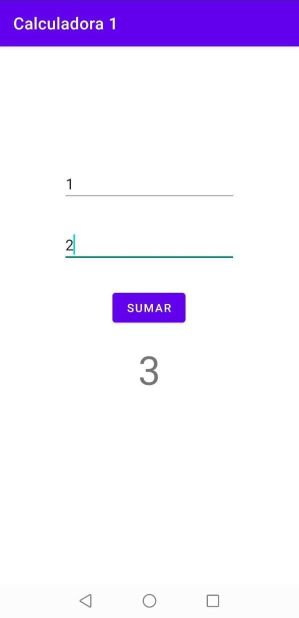
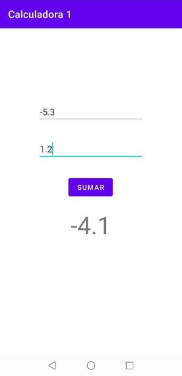
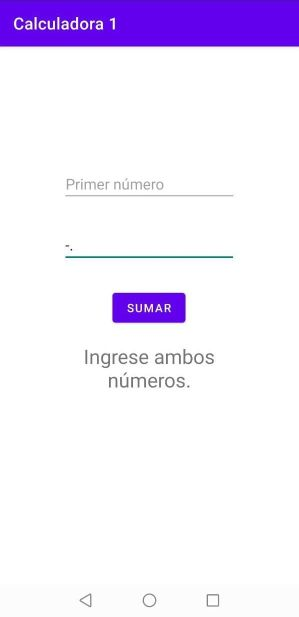

Actividades del día 5, semana 8.

(Clase 1: viernes 18 de junio de 2021)

---

Hoy comenzamos a trabajar con aplicaciones Android en Android Studio.

Las aplicaciones se componen de archivos xml que contienen información sobre los elementos visuales (botones, textos, etc) y archivos java que contienen la lógica. Android Studio permite editar el archivo xml a través su texto, o usando un editor visual que permite trabajar con el mouse y tener una vista previa de cómo se verá la aplicación.

Hoy vimos el uso de botones, mensajes emergentes (Toast), y controles para ingresar números.

---

### Ejercicio 1: Aplicación con 3 botones, cada uno de los cuales despliega un mensaje emergente.




```Java
package com.example.holamundo;

import androidx.appcompat.app.AppCompatActivity;

import android.os.Bundle;
import android.view.View;
import android.widget.Toast;

public class MainActivity extends AppCompatActivity {

    @Override
    protected void onCreate(Bundle savedInstanceState) {
        super.onCreate(savedInstanceState);
        setContentView(R.layout.activity_main);
    }

    public void mensaje1(View view)
    {
        Toast.makeText(this, "¡Hola!", Toast.LENGTH_SHORT).show();
    }

    public void mensaje2(View view)
    {
        Toast.makeText(this, "Bien, ¿y tú?", Toast.LENGTH_SHORT).show();
    }

    public void mensaje3(View view)
    {
        Toast.makeText(this, "Que estés bien.", Toast.LENGTH_SHORT).show();
    }

}
```


---

### Ejercicio 2: Calculadora que suma 2 números.

- La calculadora acepta valores positivos o negativos, con o sin decimales, y sólo muestra decimales en el resultado cuando son significativos.

- La calculadora reconoce cuando no se ha ingresado ambos números y muestra el mensaje correspondiente, a la mitad del tamaño de fuente para que no llene la pantalla.






---

```Java
package com.example.calculadora1;

import androidx.appcompat.app.AppCompatActivity;

import android.os.Bundle;
import android.util.TypedValue;
import android.view.View;
import android.widget.EditText;
import android.widget.TextView;

public class MainActivity extends AppCompatActivity {

    private EditText num1, num2;
    private TextView resultado;

    @Override
    protected void onCreate(Bundle savedInstanceState)
    {
        super.onCreate(savedInstanceState);
        setContentView(R.layout.activity_main);

        num1 = findViewById(R.id.et_num1);
        num2 = findViewById(R.id.et_num2);

        resultado = findViewById(R.id.txt_resultado);
    }

    public void sumar(View v)
    {
        if (esNumeroValido(num1.getText().toString()) && esNumeroValido(num2.getText().toString()) )
        {
            double valor1 = Double.parseDouble(num1.getText().toString());
            double valor2 = Double.parseDouble(num2.getText().toString());
            double suma = valor1 + valor2;
            resultado.setTextSize(TypedValue.COMPLEX_UNIT_SP,48);
            resultado.setText(formatear(String.valueOf(suma)));
            resultado.setTextSize(TypedValue.COMPLEX_UNIT_SP,48);
        }
        else
        {
            resultado.setTextSize(TypedValue.COMPLEX_UNIT_SP,24);
            resultado.setText("Ingrese ambos números.");
            resultado.setTextSize(TypedValue.COMPLEX_UNIT_SP,24);
        }

    }

    // Validar que efectivamente se haya ingresado un número, y no signos "-" o puntos sin dígitos.
    public boolean esNumeroValido(String num)
    {
        return !(num.replace(".", "").replace("-", "").equals(""));
    }

    // Eliminar los decimales de un número si no son significativos.
    public String formatear(String numero)
    {
        String parteEntera = numero.split("\\.")[0];
        double parteDecimal = Double.parseDouble(numero.split("\\.")[1]);

        if (parteDecimal == 0)
        {
            return parteEntera;
        }
        else
        {
            return numero;
        }
    }

}
```