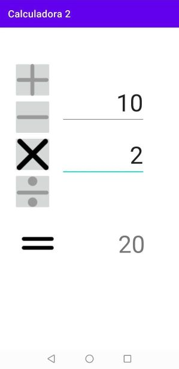
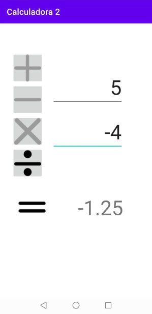
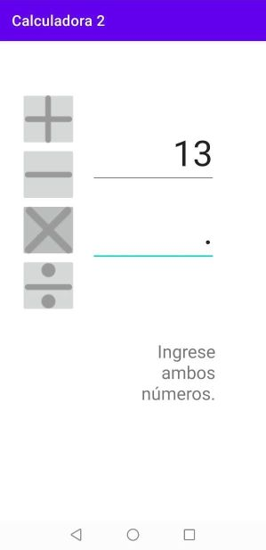
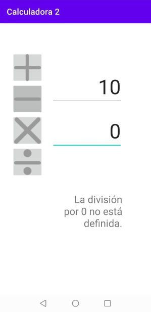
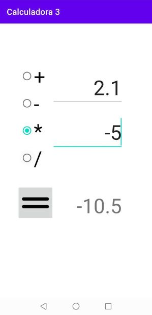
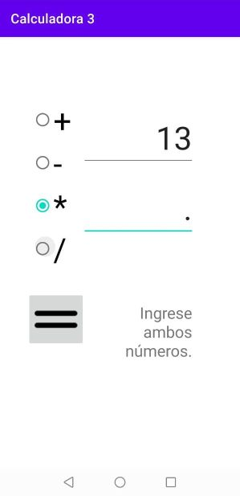
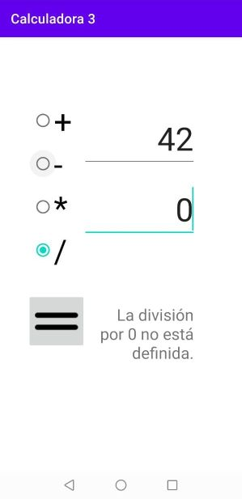
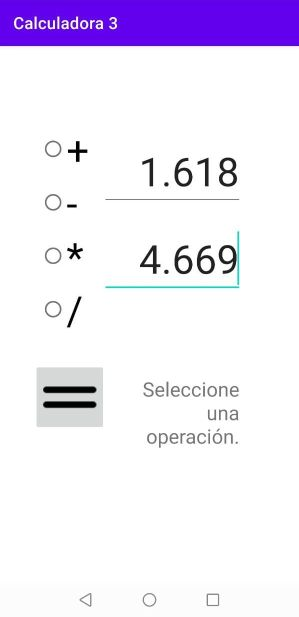

Actividades del día 2, semana 9.

(Clase 2: Martes 22 de junio de 2021)

---

La configuración de la interfaz gráfica en Android puede llegar a ser bastante engorrosa, e irónicamente aún más engorrosa debido a la interfaz gráfica de Android Studio. Por otro lado, una vez que se entiende cómo asociar los controles de la interfaz gráfica a objetos en Java, su uso básico y el desarrollo de la lógica en cierto modo no parecen ser particularmente complejos, por lo menos en los ejercicios resueltos hasta ahora.

---

### Ejercicio 1: Implementar una calculadora que pueda sumar, restar, multiplicar o dividir 2 números. La operación a realizar debe ser seleccionada usando controles ImageButton.






```Java
package com.example.calculadora2;

import androidx.appcompat.app.AppCompatActivity;

import android.os.Bundle;
import android.util.TypedValue;
import android.view.View;
import android.widget.EditText;
import android.widget.ImageButton;
import android.widget.ImageView;
import android.widget.TextView;

public class MainActivity extends AppCompatActivity
{

    private EditText et_num1, et_num2;
    private TextView tv_resultado;
    private ImageButton ib_mas;
    private ImageButton ib_menos;
    private ImageButton ib_por;
    private ImageButton ib_dividido;
    private Double num1, num2, resultado;
    private ImageView iv_igual;


    @Override
    protected void onCreate(Bundle savedInstanceState)
    {
        super.onCreate(savedInstanceState);
        setContentView(R.layout.activity_main);

        et_num1 = findViewById(R.id.et_num1);
        et_num2 = findViewById(R.id.et_num2);
        tv_resultado = findViewById(R.id.txt_resultado);
        ib_mas = (ImageButton) findViewById(R.id.ib_mas);
        ib_menos = findViewById(R.id.ib_menos);
        ib_por = findViewById(R.id.ib_por);
        ib_dividido = findViewById(R.id.ib_dividido);
        iv_igual = findViewById(R.id.iv_igual);

        // Mostrar todos los botones "desactivados".
        ib_mas.setImageDrawable(this.getDrawable(R.drawable.mas_off));
        ib_menos.setImageDrawable(this.getDrawable(R.drawable.menos_off));
        ib_por.setImageDrawable(this.getDrawable(R.drawable.por_off));
        ib_dividido.setImageDrawable(this.getDrawable(R.drawable.dividido_off));
    }

    public void sumar(View v)
    {
        ib_mas.setImageDrawable(this.getDrawable(R.drawable.mas_on));
        ib_menos.setImageDrawable(this.getDrawable(R.drawable.menos_off));
        ib_por.setImageDrawable(this.getDrawable(R.drawable.por_off));
        ib_dividido.setImageDrawable(this.getDrawable(R.drawable.dividido_off));

        if (cargarNumeros())
        {
            resultado = num1 + num2;
            mostrarResultado(resultado);
        }
    }


    public void restar(View v)
    {
        ib_mas.setImageDrawable(this.getDrawable(R.drawable.mas_off));
        ib_menos.setImageDrawable(this.getDrawable(R.drawable.menos_on));
        ib_por.setImageDrawable(this.getDrawable(R.drawable.por_off));
        ib_dividido.setImageDrawable(this.getDrawable(R.drawable.dividido_off));

        if (cargarNumeros())
        {
            resultado = num1 - num2;
            mostrarResultado(resultado);
        }

    }


    public void multiplicar(View v)
    {
        ib_mas.setImageDrawable(this.getDrawable(R.drawable.mas_off));
        ib_menos.setImageDrawable(this.getDrawable(R.drawable.menos_off));
        ib_por.setImageDrawable(this.getDrawable(R.drawable.por_on));
        ib_dividido.setImageDrawable(this.getDrawable(R.drawable.dividido_off));

        if (cargarNumeros())
        {
            resultado = num1 * num2;
            mostrarResultado(resultado);
        }
    }


    public void dividir(View v)
    {
        ib_mas.setImageDrawable(this.getDrawable(R.drawable.mas_off));
        ib_menos.setImageDrawable(this.getDrawable(R.drawable.menos_off));
        ib_por.setImageDrawable(this.getDrawable(R.drawable.por_off));
        ib_dividido.setImageDrawable(this.getDrawable(R.drawable.dividido_on));

        if (cargarNumeros())
        {
            if (num2 == 0)
            {
                mostrarMensaje("La división por 0 no está definida.");
            }
            else
            {
                resultado = num1 / num2;
                mostrarResultado(resultado);
            }
        }
    }


    // Si ambos números fueron ingresados correctamente, almacenar sus valores en variables double.
    // De lo contrario, solicitar que se ingrese ambos números.
    public boolean cargarNumeros()
    {
        String string_num1 = et_num1.getText().toString();
        String string_num2 = et_num2.getText().toString();
        if (esNumeroValido(string_num1) && esNumeroValido(string_num2))
        {
            num1 = Double.parseDouble(string_num1);
            num2 = Double.parseDouble(string_num2);
            return true;
        }
        else
        {
            mostrarMensaje("Ingrese ambos números.");
            return false;
        }
    }


    // Validar que efectivamente se haya ingresado un número, y no signos "-" o puntos sin dígitos.
    public boolean esNumeroValido(String num)
    {
        return !(num.replace(".", "").replace("-", "").equals(""));
    }


    // Eliminar los decimales de un número si no son significativos.
    public String formatear(String numero)
    {
        String parteEntera = numero.split("\\.")[0];
        double parteDecimal = Double.parseDouble(numero.split("\\.")[1]);

        if (parteDecimal == 0)
        {
            return parteEntera;
        }
        else
        {
            return numero;
        }
    }


    public void mostrarResultado(double resultado)
    {
        iv_igual.setVisibility(View.VISIBLE);
        tv_resultado.setTextSize(TypedValue.COMPLEX_UNIT_SP,48);
        tv_resultado.setText(formatear(String.valueOf(resultado)));
    }


    public void mostrarMensaje(String mensaje)
    {
        iv_igual.setVisibility(View.INVISIBLE);
        ib_mas.setImageDrawable(this.getDrawable(R.drawable.mas_off));
        ib_menos.setImageDrawable(this.getDrawable(R.drawable.menos_off));
        ib_por.setImageDrawable(this.getDrawable(R.drawable.por_off));
        ib_dividido.setImageDrawable(this.getDrawable(R.drawable.dividido_off));
        tv_resultado.setTextSize(TypedValue.COMPLEX_UNIT_SP,24);
        tv_resultado.setText(mensaje);
    }

}
```


### Ejercicio 2: Implementar la misma calculadora, pero esta vez seleccionar la operación a realizar usando controles RadioButton.






```Java
package com.example.calculadora3;

import androidx.appcompat.app.AppCompatActivity;

import android.os.Bundle;
import android.util.TypedValue;
import android.view.View;
import android.widget.EditText;
import android.widget.RadioButton;
import android.widget.TextView;

public class MainActivity extends AppCompatActivity
{

    private EditText et_num1, et_num2;
    private TextView tv_resultado;
    private RadioButton rb_sumar, rb_restar, rb_multiplicar, rb_dividir;
    private Double num1, num2, resultado;


    @Override
    protected void onCreate(Bundle savedInstanceState)
    {
        super.onCreate(savedInstanceState);
        setContentView(R.layout.activity_main);

        et_num1 = findViewById(R.id.et_num1);
        et_num2 = findViewById(R.id.et_num2);
        tv_resultado = findViewById(R.id.txt_resultado);
        rb_sumar = findViewById(R.id.rb_sumar);
        rb_restar = findViewById(R.id.rb_restar);
        rb_multiplicar = findViewById(R.id.rb_multiplicar);
        rb_dividir = findViewById(R.id.rb_dividir);
    }


    public void calcular(View v)
    {
        if(rb_sumar.isChecked())
        {
            sumar();
        }
        else if (rb_restar.isChecked())
        {
            restar();
        }
        else if (rb_multiplicar.isChecked())
        {
            multiplicar();
        }
        else if (rb_dividir.isChecked())
        {
            dividir();
        }
        else
        {
            mostrarMensaje("Seleccione una operación.");
        }
    }


    public void sumar()
    {
        if (cargarNumeros())
        {
            resultado = num1 + num2;
            mostrarResultado(resultado);
        }
    }


    public void restar()
    {
        if (cargarNumeros())
        {
            resultado = num1 - num2;
            mostrarResultado(resultado);
        }
    }


    public void multiplicar()
    {
        if (cargarNumeros())
        {
            resultado = num1 * num2;
            mostrarResultado(resultado);
        }
    }


    public void dividir()
    {
        if (cargarNumeros())
        {
            if (num2 == 0)
            {
                mostrarMensaje("La división por 0 no está definida.");
            }
            else
            {
                resultado = num1 / num2;
                mostrarResultado(resultado);
            }
        }
    }


    // Si ambos números fueron ingresados correctamente, almacenar sus valores en variables double.
    // De lo contrario, solicitar que se ingrese ambos números.
    public boolean cargarNumeros()
    {
        String string_num1 = et_num1.getText().toString();
        String string_num2 = et_num2.getText().toString();
        if (esNumeroValido(string_num1) && esNumeroValido(string_num2))
        {
            num1 = Double.parseDouble(string_num1);
            num2 = Double.parseDouble(string_num2);
            return true;
        }
        else
        {
            mostrarMensaje("Ingrese ambos números.");
            return false;
        }
    }


    // Validar que efectivamente se haya ingresado un número, y no signos "-" o puntos sin dígitos.
    public boolean esNumeroValido(String num)
    {
        return !(num.replace(".", "").replace("-", "").equals(""));
    }


    // Eliminar los decimales de un número si no son significativos.
    public String formatear(String numero)
    {
        String parteEntera = numero.split("\\.")[0];
        double parteDecimal = Double.parseDouble(numero.split("\\.")[1]);

        if (parteDecimal == 0)
        {
            return parteEntera;
        }
        else
        {
            return numero;
        }
    }


    public void mostrarResultado(double resultado)
    {
        tv_resultado.setTextSize(TypedValue.COMPLEX_UNIT_SP,48);
        tv_resultado.setText(formatear(String.valueOf(resultado)));
    }


    public void mostrarMensaje(String mensaje)
    {
        tv_resultado.setTextSize(TypedValue.COMPLEX_UNIT_SP,24);
        tv_resultado.setText(mensaje);
    }

}
```

---

#### Créditos:

Íconos creados por [Freepik](https://www.flaticon.com/authors/freepik)
de www.flaticon.com.