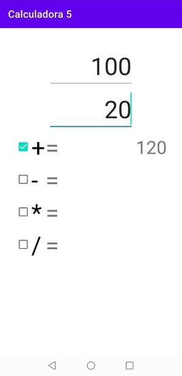
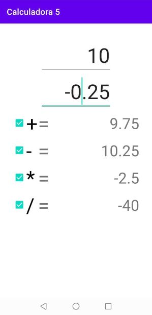
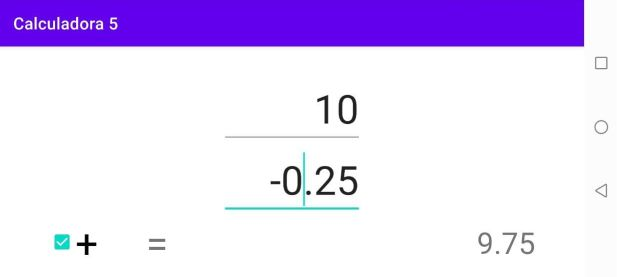
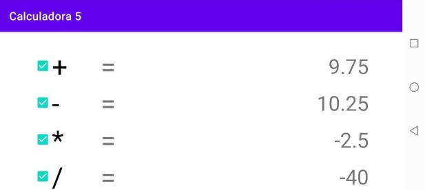

Actividades del día 3, semana 9.

(Clase 3: Martes 23 de junio de 2021)

---

Hoy estudiamos el uso de CheckBox, y el uso de otros layouts aparte del ConstraintLayout que habíamos usado hasta ahora.

A diferencia de RadioButton, donde cada RadioButton pertenece a un RadioGroup donde sólo puede haber 1 botón activado a la vez, los CheckBox no se agrupan, y cada uno puede ser activado independientemente del resto.

En cuanto a layouts, probé el uso de LinearLayout vertical y horizontal, que permiten apilar los elementos uno tras otro automáticamente.

En cuanto a los scrolls, permiten desplazarse por la pantalla para poder ver elementos que de otro modo quedarían ocultos al no caber en una sola pantalla.

---

### Ejercicio 1: Usar checkbox en la calculadora.

### Ejercicio 2: Utilizar otros layouts y ScrollView.

- La calculadora puede realizar una o más operaciones seleccionadas a través de CheckBox.




- El elemento ScrollView permite desplazar otros elementos en la pantalla cuando algunos quedan fuera de ella por falta de espacio.




```Java
package com.example.calculadora5;

import androidx.appcompat.app.AppCompatActivity;

import android.os.Bundle;
import android.util.TypedValue;
import android.view.View;
import android.widget.CheckBox;
import android.widget.EditText;
import android.widget.TextView;
import android.widget.Toast;

public class MainActivity extends AppCompatActivity
{
    private EditText et_num1, et_num2;
    private TextView tv_resultado_sumar, tv_resultado_restar;
    private TextView tv_resultado_multiplicar, tv_resultado_dividir;
    private CheckBox cb_sumar, cb_restar, cb_multiplicar, cb_dividir;
    private Double num1, num2, resultado;

    @Override
    protected void onCreate(Bundle savedInstanceState)
    {
        super.onCreate(savedInstanceState);
        setContentView(R.layout.activity_main);

        et_num1 = findViewById(R.id.et_num1);
        et_num2 = findViewById(R.id.et_num2);
        tv_resultado_sumar = findViewById(R.id.tv_resultado_sumar);
        tv_resultado_restar = findViewById(R.id.tv_resultado_restar);
        tv_resultado_multiplicar = findViewById(R.id.tv_resultado_multiplicar);
        tv_resultado_dividir = findViewById(R.id.tv_resultado_dividir);
        cb_sumar = findViewById(R.id.cb_sumar);
        cb_restar = findViewById(R.id.cb_restar);
        cb_multiplicar = findViewById(R.id.cb_multiplicar);
        cb_dividir = findViewById(R.id.cb_dividir);
    }

    public void calcular(View v) {
        if (cargarNumeros()) {
            if (cb_sumar.isChecked()) {
                sumar();
            }
            else
            {
                tv_resultado_sumar.setText("");
            }

            if (cb_restar.isChecked())
            {
                restar();
            }
            else
            {
                tv_resultado_restar.setText("");
            }

            if (cb_multiplicar.isChecked())
            {
                multiplicar();
            }
            else
            {
                tv_resultado_multiplicar.setText("");
            }

            if (cb_dividir.isChecked())
            {
                dividir();
            }
            else
            {
                tv_resultado_dividir.setText("");
            }
        }
    }

    public void sumar()
    {
            resultado = num1 + num2;
            mostrarResultado(tv_resultado_sumar, resultado);
    }

    public void restar()
    {
             resultado = num1 - num2;
            mostrarResultado(tv_resultado_restar, resultado);
    }

    public void multiplicar()
    {
            resultado = num1 * num2;
            mostrarResultado(tv_resultado_multiplicar, resultado);
    }

    public void dividir()
    {
        if (num2 == 0)
        {
            mostrarMensaje(tv_resultado_dividir,"La división por 0 no está definida.");
        }
        else
        {
            resultado = num1 / num2;
            mostrarResultado(tv_resultado_dividir, resultado);
        }
    }

    // Si ambos números fueron ingresados correctamente, almacenar sus valores en variables double.
    // De lo contrario, borrar los resultados, deseleccionar los CheckBox
    // y solicitar que se ingrese ambos números.
    public boolean cargarNumeros()
    {
        String string_num1 = et_num1.getText().toString();
        String string_num2 = et_num2.getText().toString();
        if (esNumeroValido(string_num1) && esNumeroValido(string_num2))
        {
            num1 = Double.parseDouble(string_num1);
            num2 = Double.parseDouble(string_num2);
            return true;
        }
        else
        {
            tv_resultado_sumar.setText("");
            tv_resultado_restar.setText("");
            tv_resultado_multiplicar.setText("");
            tv_resultado_dividir.setText("");
            cb_sumar.setChecked(false);
            cb_restar.setChecked(false);
            cb_multiplicar.setChecked(false);
            cb_dividir.setChecked(false);
            Toast.makeText(this, "Ingrese ambos números.", Toast.LENGTH_SHORT).show();
            return false;
        }
    }

    // Validar que efectivamente se haya ingresado un número, y no signos "-" o puntos sin dígitos.
    public boolean esNumeroValido(String num)
    {
        return !(num.replace(".", "").replace("-", "").equals(""));
    }

    // Eliminar los decimales de un número si no son significativos.
    public String formatear(String numero)
    {
        String parteEntera = numero.split("\\.")[0];
        double parteDecimal = Double.parseDouble(numero.split("\\.")[1]);

        if (parteDecimal == 0)
        {
            return parteEntera;
        }
        else
        {
            return numero;
        }
    }

    public void mostrarResultado(TextView texto, double resultado)
    {
        texto.setTextSize(TypedValue.COMPLEX_UNIT_SP,36);
        texto.setText(formatear(String.valueOf(resultado)));
    }


    public void mostrarMensaje(TextView texto, String mensaje)
    {
        texto.setTextSize(TypedValue.COMPLEX_UNIT_SP,24);
        texto.setText(mensaje);
    }

}
```