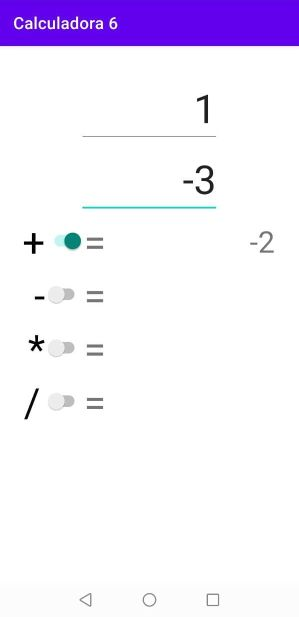
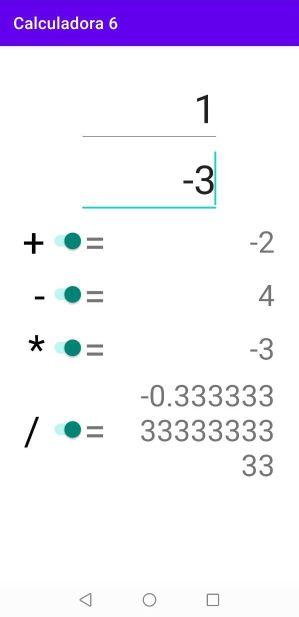
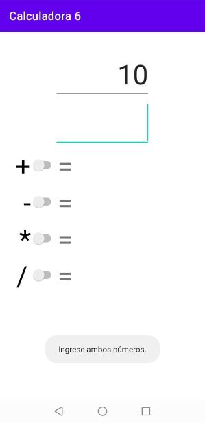
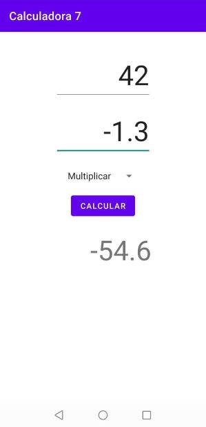
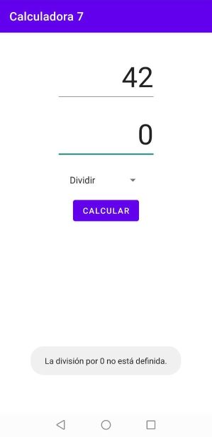
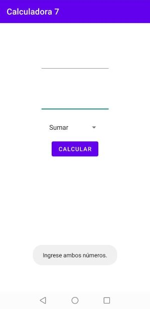

Actividades del día 4, semana 9.

(Clase 4: jueves 24 de junio de 2021)

---

Hoy aprendimos el uso del archivo `strings.xml` y los controles `Switch` y `Spinner`.

El archivo `strings.xml` se utiliza para guardar las cadenas de texto usadas en la aplicación y guardar el texto de la interfaz independientemente de los elementos gráficos y la lógica de la aplicación. Esto permite entre otras cosas traducir la aplicación sin tener que modificar las clases de Java.

El formato del archivo `strings.xml` es el siguiente:

```xml
<string name="nombre_de_la_cadena">Texto a mostrar</string>
```

Se puede acceder a las cadenas almacenadas en el archivo `strings.xml` desde Java con el siguiente código:

```Java
String variable_string = getString(R.string.nombre_de_la_cadena);
```

El control `Switch` funciona de forma equivalente a los controles `CheckBox`, pero en vez de marcar o desmarcar un recuadro, se mueve un interruptor de un lado a otro.

El control `Spinner` permite seleccionar una entre varias alternativas.

---

### Ejercicio 1: Crear una calculadora usando switches para seleccionar las operaciones a realizar.

Además, de ahora en adelante guardaremos las cadenas de texto en el archivo **`strings.xml`**, lo que ayuda entre otras cosas a traducir la aplicación a otros idiomas.






**strings.xml**
```xml
<resources>
    <string name="app_name">Calculadora 6</string>
    <string name="primer_numero">Primer número</string>
    <string name="segundo_numero">Segundo número</string>
    <string name="div_0">La división por 0 no está definida.</string>
    <string name="pedir_numeros">Ingrese ambos números.</string>
    <string name="sw_sumar">+</string>
    <string name="sw_restar">-</string>
    <string name="sw_multiplicar">*</string>
    <string name="sw_dividir">/</string>
    <string name="vt_igual">=</string>
    <string name="resultado_suma">Resultado suma</string>
    <string name="resultado_resta">Resultado resta</string>
    <string name="resultado_multiplicacion">Resultado multilpicación</string>
    <string name="resultado_division">Resultado división</string>
</resources>
```


**MainActivity.java**
```Java
package com.example.calculadora6;

import androidx.appcompat.app.AppCompatActivity;

import android.os.Bundle;
import android.util.TypedValue;
import android.view.View;
import android.widget.EditText;
import android.widget.Switch;
import android.widget.TextView;
import android.widget.Toast;

public class MainActivity extends AppCompatActivity
{
    private EditText et_num1, et_num2;
    private TextView tv_resultado_sumar, tv_resultado_restar;
    private TextView tv_resultado_multiplicar, tv_resultado_dividir;
    private Switch sw_sumar, sw_restar, sw_multiplicar, sw_dividir;
    private Double num1, num2, resultado;

    @Override
    protected void onCreate(Bundle savedInstanceState)
    {
        super.onCreate(savedInstanceState);
        setContentView(R.layout.activity_main);

        et_num1 = findViewById(R.id.et_num1);
        et_num2 = findViewById(R.id.et_num2);
        tv_resultado_sumar = findViewById(R.id.tv_resultado_sumar);
        tv_resultado_restar = findViewById(R.id.tv_resultado_restar);
        tv_resultado_multiplicar = findViewById(R.id.tv_resultado_multiplicar);
        tv_resultado_dividir = findViewById(R.id.tv_resultado_dividir);
        sw_sumar = findViewById(R.id.sw_sumar);
        sw_restar = findViewById(R.id.sw_restar);
        sw_multiplicar = findViewById(R.id.sw_multiplicar);
        sw_dividir = findViewById(R.id.sw_dividir);
    }

    public void calcular(View v) {
        if (cargarNumeros()) {
            if (sw_sumar.isChecked()) {
                sumar();
            }
            else
            {
                tv_resultado_sumar.setText("");
            }

            if (sw_restar.isChecked())
            {
                restar();
            }
            else
            {
                tv_resultado_restar.setText("");
            }

            if (sw_multiplicar.isChecked())
            {
                multiplicar();
            }
            else
            {
                tv_resultado_multiplicar.setText("");
            }

            if (sw_dividir.isChecked())
            {
                dividir();
            }
            else
            {
                tv_resultado_dividir.setText("");
            }
        }
    }

    public void sumar()
    {
            resultado = num1 + num2;
            mostrarResultado(tv_resultado_sumar, resultado);
    }

    public void restar()
    {
             resultado = num1 - num2;
            mostrarResultado(tv_resultado_restar, resultado);
    }

    public void multiplicar()
    {
            resultado = num1 * num2;
            mostrarResultado(tv_resultado_multiplicar, resultado);
    }

    public void dividir()
    {
        if (num2 == 0)
        {
            mostrarMensaje(tv_resultado_dividir,getString(R.string.div_0));
        }
        else
        {
            resultado = num1 / num2;
            mostrarResultado(tv_resultado_dividir, resultado);
        }
    }

    // Si ambos números fueron ingresados correctamente, almacenar sus valores en variables double.
    // De lo contrario, borrar los resultados, deseleccionar los CheckBox
    // y solicitar que se ingrese ambos números.
    public boolean cargarNumeros()
    {
        String string_num1 = et_num1.getText().toString();
        String string_num2 = et_num2.getText().toString();
        if (esNumeroValido(string_num1) && esNumeroValido(string_num2))
        {
            num1 = Double.parseDouble(string_num1);
            num2 = Double.parseDouble(string_num2);
            return true;
        }
        else
        {
            tv_resultado_sumar.setText("");
            tv_resultado_restar.setText("");
            tv_resultado_multiplicar.setText("");
            tv_resultado_dividir.setText("");
            sw_sumar.setChecked(false);
            sw_restar.setChecked(false);
            sw_multiplicar.setChecked(false);
            sw_dividir.setChecked(false);
            Toast.makeText(this, getString(R.string.pedir_numeros), Toast.LENGTH_SHORT).show();
            return false;
        }
    }

    // Validar que efectivamente se haya ingresado un número, y no signos "-" o puntos sin dígitos.
    public boolean esNumeroValido(String num)
    {
        return !(num.replace(".", "").replace("-", "").equals(""));
    }

    // Eliminar los decimales de un número si no son significativos.
    public String formatear(String numero)
    {
        String parteEntera = numero.split("\\.")[0];
        double parteDecimal = Double.parseDouble(numero.split("\\.")[1]);

        if (parteDecimal == 0)
        {
            return parteEntera;
        }
        else
        {
            return numero;
        }
    }

    public void mostrarResultado(TextView texto, double resultado)
    {
        texto.setTextSize(TypedValue.COMPLEX_UNIT_SP,36);
        texto.setText(formatear(String.valueOf(resultado)));
    }


    public void mostrarMensaje(TextView texto, String mensaje)
    {
        texto.setTextSize(TypedValue.COMPLEX_UNIT_SP,24);
        texto.setText(mensaje);
    }

}
```


### Ejercicio 2: Crear una calculadora usando un control spinner para seleccionar la operación a realizar.





**MainActivity.java**
```Java
package com.example.calculadora7;

import androidx.appcompat.app.AppCompatActivity;

import android.os.Bundle;
import android.util.TypedValue;
import android.view.View;
import android.widget.ArrayAdapter;
import android.widget.EditText;
import android.widget.Spinner;
import android.widget.TextView;
import android.widget.Toast;

public class MainActivity extends AppCompatActivity
{
    private EditText et_num1, et_num2;
    private TextView tv_resultado;
    private Double num1, num2, resultado;
    private Spinner sp_operaciones, sp_operaciones2;


    @Override
    protected void onCreate(Bundle savedInstanceState)
    {
        super.onCreate(savedInstanceState);
        setContentView(R.layout.activity_main);

        et_num1 = findViewById(R.id.et_num1);
        et_num2 = findViewById(R.id.et_num2);
        tv_resultado = findViewById(R.id.tv_resultado);
        sp_operaciones = findViewById(R.id.sp_operaciones);
        String[] operaciones =
            {
              getString(R.string.sp_sumar)
            , getString(R.string.sp_restar)
            , getString(R.string.sp_multiplicar)
            , getString(R.string.sp_dividir)
            };
        ArrayAdapter<String> adapter = new ArrayAdapter<>(this, android.R.layout.simple_spinner_item, operaciones);
        sp_operaciones.setAdapter(adapter);
    }

    public void calcular(View v) {
        String opcion = sp_operaciones.getSelectedItem().toString();
        if (cargarNumeros()) {
            if (opcion.equals(getString(R.string.sp_sumar))) {
                sumar();
            }
            else if (opcion.equals(getString(R.string.sp_restar)))
            {
                restar();
            }
            else if (opcion.equals(getString(R.string.sp_multiplicar)))
            {
                multiplicar();
            }
            else if (opcion.equals(getString(R.string.sp_dividir)))
            {
                dividir();
            }
            else
            {
                tv_resultado.setText("");
            }
        }
    }

    public void sumar()
    {
            resultado = num1 + num2;
            mostrarResultado(tv_resultado, resultado);
    }

    public void restar()
    {
             resultado = num1 - num2;
            mostrarResultado(tv_resultado, resultado);
    }

    public void multiplicar()
    {
            resultado = num1 * num2;
            mostrarResultado(tv_resultado, resultado);
    }

    public void dividir()
    {
        if (num2 == 0)
        {
            tv_resultado.setText("");
            Toast.makeText(this, getString(R.string.div_0), Toast.LENGTH_SHORT).show();
        }
        else
        {
            resultado = num1 / num2;
            mostrarResultado(tv_resultado, resultado);
        }
    }

    // Si ambos números fueron ingresados correctamente, almacenar sus valores en variables double.
    // De lo contrario, borrar los resultados, deseleccionar los CheckBox
    // y solicitar que se ingrese ambos números.
    public boolean cargarNumeros()
    {
        String string_num1 = et_num1.getText().toString();
        String string_num2 = et_num2.getText().toString();
        if (esNumeroValido(string_num1) && esNumeroValido(string_num2))
        {
            num1 = Double.parseDouble(string_num1);
            num2 = Double.parseDouble(string_num2);
            return true;
        }
        else
        {
            tv_resultado.setText("");
            Toast.makeText(this, getString(R.string.pedir_numeros), Toast.LENGTH_SHORT).show();
            return false;
        }
    }

    // Validar que efectivamente se haya ingresado un número, y no signos "-" o puntos sin dígitos.
    public boolean esNumeroValido(String num)
    {
        return !(num.replace(".", "").replace("-", "").equals(""));
    }

    // Eliminar los decimales de un número si no son significativos.
    public String formatear(String numero)
    {
        String parteEntera = numero.split("\\.")[0];
        double parteDecimal = Double.parseDouble(numero.split("\\.")[1]);

        if (parteDecimal == 0)
        {
            return parteEntera;
        }
        else
        {
            return numero;
        }
    }

    public void mostrarResultado(TextView texto, double resultado)
    {
        texto.setTextSize(TypedValue.COMPLEX_UNIT_SP,48);
        texto.setText(formatear(String.valueOf(resultado)));
    }


    public void mostrarMensaje(TextView texto, String mensaje)
    {
        texto.setTextSize(TypedValue.COMPLEX_UNIT_SP,24);
        texto.setText(mensaje);
    }

}
```