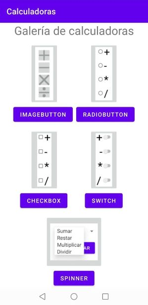
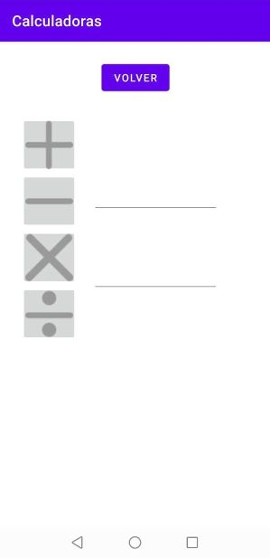

Actividades del día 5, semana 9.

(Clase 5: viernes 25 de junio de 2021)

---

La clase `Intent` y el método `startActivity` son quienes permiten pasar de una activity a otra, lo que permite crear aplicaciones con más de una pantalla.

Para demostrar lo aprendido en esta clase, hice una galería con los ejercicios hechos hasta ahora. Cada calculadora está en una activity distinta, y la pantalla de bienvenida es un menú desde donde se puede acceder a cada una de ellas. En cada calculadora agregué un botón para poder volver al menú principal.

---

### Ejercicio: Crear una aplicación con más de 2 activities y botones para desplazarse entre ellas.




- MainActivity.java
```Java
package com.example.calculadoras;

import androidx.appcompat.app.AppCompatActivity;

import android.content.Intent;
import android.os.Bundle;
import android.view.View;

public class MainActivity extends AppCompatActivity {

    @Override
    protected void onCreate(Bundle savedInstanceState) {
        super.onCreate(savedInstanceState);
        setContentView(R.layout.activity_main);
    }

    public void irImageButton(View v)
    {
        Intent calculadoraImageButton = new Intent(this, calculadoraImageButton.class);
        startActivity(calculadoraImageButton);
    }

    public void irRadioButton(View v)
    {
        Intent calculadoraRadioButton = new Intent(this, calculadoraRadioButton.class);
        startActivity(calculadoraRadioButton);
    }

        public void irCheckBox(View v)
    {
        Intent calculadoraCheckBox = new Intent(this, calculadoraCheckBox.class);
        startActivity(calculadoraCheckBox);
    }

        public void irSwitch(View v)
    {
        Intent calculadoraSwitch = new Intent(this, calculadoraSwitch.class);
        startActivity(calculadoraSwitch);
    }

    public void irSpinner(View v)
    {
        Intent calculadoraSpinner = new Intent(this, calculadoraSpinner.class);
        startActivity(calculadoraSpinner);
    }

}
```
- Código usado en las pantallas secundarias para volver al menú principal.
```Java
    public void volver(View v)
    {
        Intent inicio = new Intent(this, MainActivity.class);
        startActivity(inicio);
    }
```